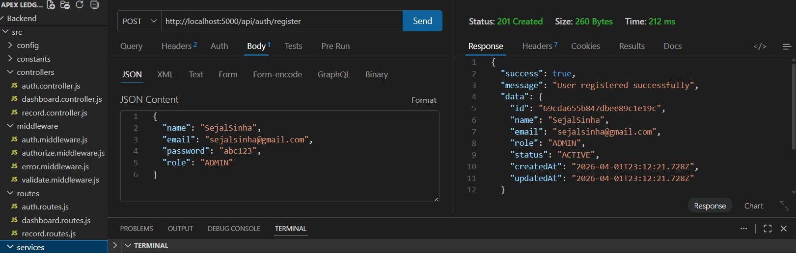
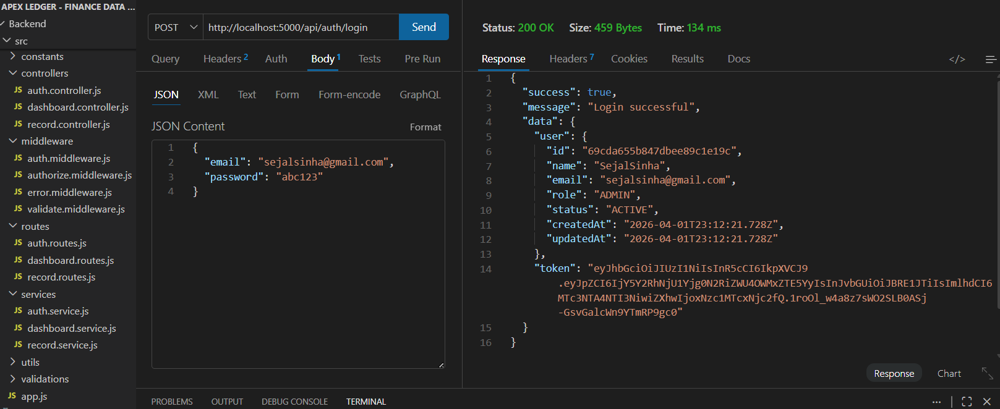
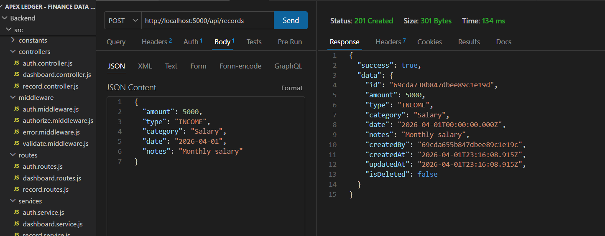
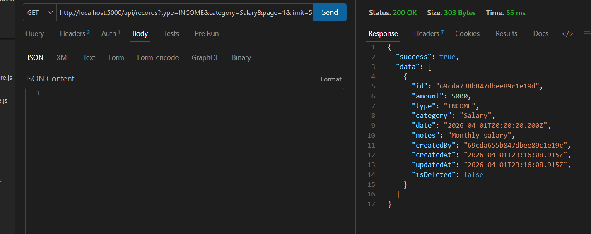
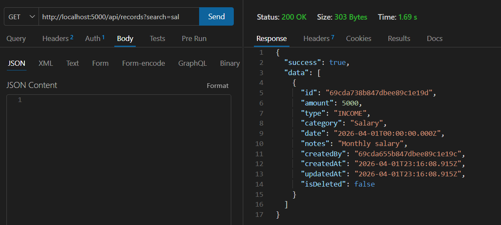
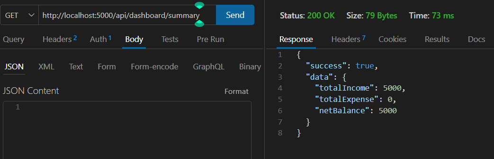
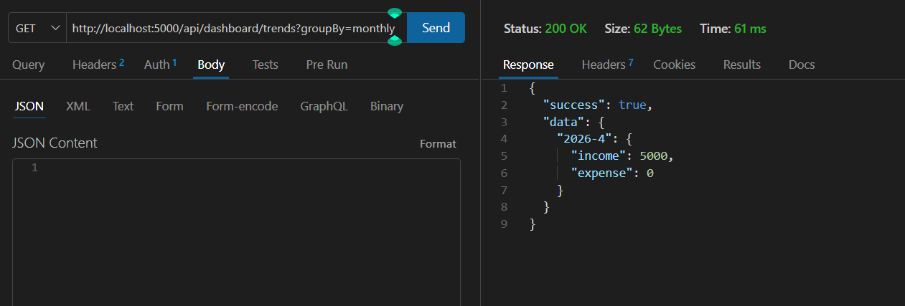
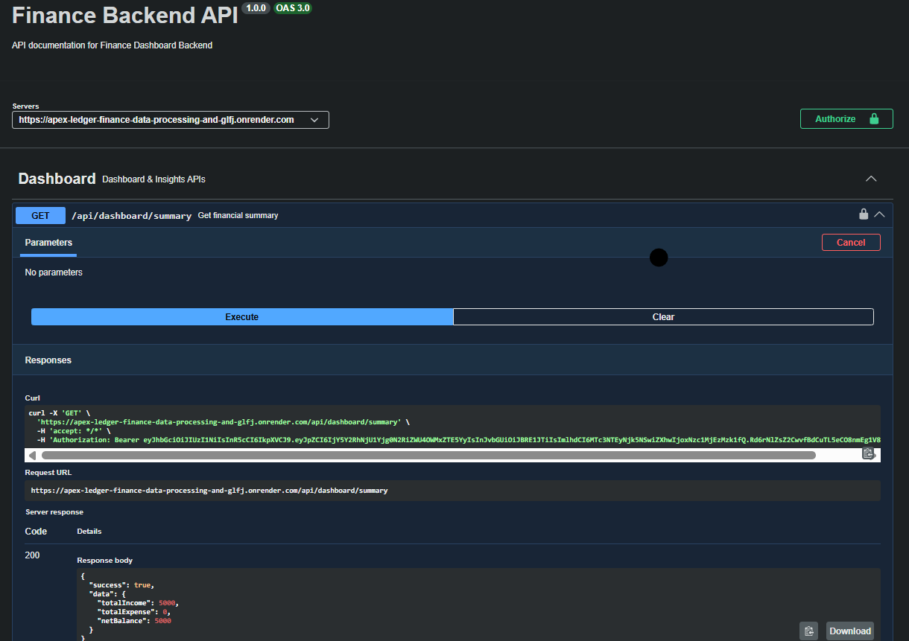
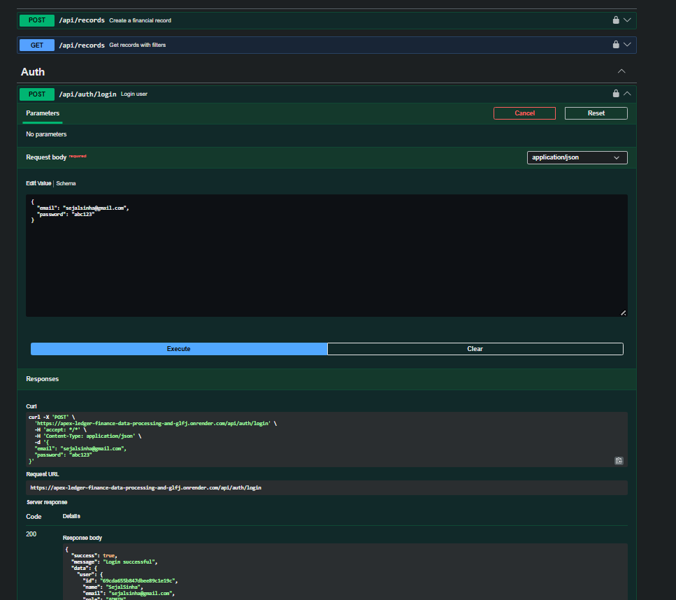

## APEX LEDGER - Finance Data Processing & Access Control Backend

##  Project Overview

This project is a backend system designed for a finance dashboard where users interact with financial data based on role-based access control.

The primary goal of this implementation was to design a backend that is **cleanly structured, logically organized, and aligned with real-world engineering practices**, rather than just fulfilling functional requirements.

Along with core features like financial record management and user roles, I focused on building:

* A modular and scalable architecture
* Clear separation of concerns
* Robust access control (RBAC)
* Meaningful data aggregation for analytics

---

##  Key Highlights

*  JWT-based authentication with secure password handling
*  Role-based access control (Viewer, Analyst, Admin)
*  Dashboard APIs with financial summaries and trends
*  Advanced filtering, pagination, and search
*  Insights layer (top categories, trends) beyond CRUD
*  Input validation and centralized error handling
*  Clean MVC + service-layer architecture

---

##  Approach & Thought Process

While building this project, I focused on how a backend system should behave in a real-world scenario:

* Keeping controllers lightweight and moving logic to services
* Designing APIs that are flexible and scalable
* Ensuring that access control is enforced centrally using middleware
* Structuring data in a way that supports both operations and analytics

The objective was to build something that is not just functional, but also **maintainable and extensible**.

---

## 🏗️ How I Structured the Backend

I followed a modular structure with clear separation of concerns:

```
src/
 ├── config/        → Database setup
 ├── controllers/   → Handle request & response
 ├── services/      → Business logic
 ├── routes/        → API routes
 ├── middleware/    → Auth, RBAC, validation, errors
 ├── validations/   → Zod schemas
 ├── constants/     → Roles & permissions
 ├── utils/         → JWT & hashing helpers
 └── prisma/        → Database schema
```

###  Why this structure?

I wanted to ensure:

* Controllers stay clean
* Business logic is reusable
* Authorization is centralized
* Code is easy to scale and maintain

---

##  Tech Stack I Chose

* Node.js + Express (backend)
* MongoDB Atlas (database)
* Prisma ORM (schema + queries)
* JWT (authentication)
* Zod (validation)

---

##  Authentication & Roles

### Authentication

* JWT-based login system
* Passwords hashed using bcrypt

### Roles Implemented

| Role    | What they can do               |
| ------- | ------------------------------ |
| Viewer  | Only view dashboard            |
| Analyst | View records + insights        |
| Admin   | Full control (records + users) |

All permissions are enforced using middleware.

---

## 💰 Financial Records (Core Feature)

Each record includes:

* Amount
* Type (INCOME / EXPENSE)
* Category
* Date
* Notes

### Supported Operations:

* Create record
* View records
* Update record
* Delete record (soft delete)

---

## 🔍 Filtering, Pagination & Search

I implemented flexible querying so records can be filtered by:

* Type
* Category
* Date range
* Search (category-based)
* Pagination

---

## 📊 Dashboard APIs

These APIs provide summary-level insights:

* Total income
* Total expenses
* Net balance
* Category-wise totals
* Recent activity

---

## 📈 Insights (What I Focused On Most)

To go beyond CRUD, I added:

* Monthly trends
* Weekly trends
* Top spending categories

This was important to show how backend can support analytics.

---

## 🛡️ Validation & Error Handling

* Zod used for request validation
* Centralized error handling middleware
* Proper status codes and responses

---

## 🗄️ Data Modeling

### User

* name, email, password (hashed)
* role, status

### Financial Record

* amount, type, category, date, notes
* createdBy (user reference)
* isDeleted (soft delete)

Indexes added for:

* date
* type
* category

---
# 📸 API Screenshots (With Exact Inputs)

---

## 🔹 1. Register User

**POST** `/api/auth/register`

📸 Screenshot: 

---

## 🔹 2. Login User

**POST** `/api/auth/login`

📸 Screenshot: 

---

## 🔹 3. Create Record

**POST** `/api/records`

```
Authorization: Bearer <TOKEN>
```

```json
{
  "amount": 5000,
  "type": "INCOME",
  "category": "Salary",
  "date": "2026-04-01",
  "notes": "Monthly salary"
}
```

📸 Screenshot: 

---

## 🔹 4. Get Records (Filtering + Pagination)

**GET**

```
/api/records?type=INCOME&category=Salary&page=1&limit=5
```

Headers:

```
Authorization: Bearer <TOKEN>
```

📸 Screenshot: 

---

## 🔹 5. Search Records

**GET**

```
/api/records?search=sal
```

📸 Screenshot: 

---

## 🔹 6. Dashboard Summary

**GET**

```
/api/dashboard/summary
```

📸 Screenshot: 

---

## 🔹 7. Trends (Monthly)

**GET**

```
/api/dashboard/trends?groupBy=monthly
```

📸 Screenshot: 

---
## 🔹 8. Swagger Docs 

📸 Screenshot:  



#  Setup Instructions

```bash
npm install
npm run dev
```

---

##  Environment Variables

```
DATABASE_URL=your_mongodb_url
JWT_SECRET=your_secret
PORT=5000
```

---

##  Assumptions I Made

* Roles are fixed (Viewer, Analyst, Admin)
* Backend is API-first (frontend not included)
* MongoDB chosen for flexibility

---


##  Final Thoughts

This project helped me focus on how backend systems should be structured in real-world scenarios — not just making APIs work, but making them clean, scalable, and meaningful.

I tried to balance correctness, simplicity, and thoughtful design throughout the implementation.
